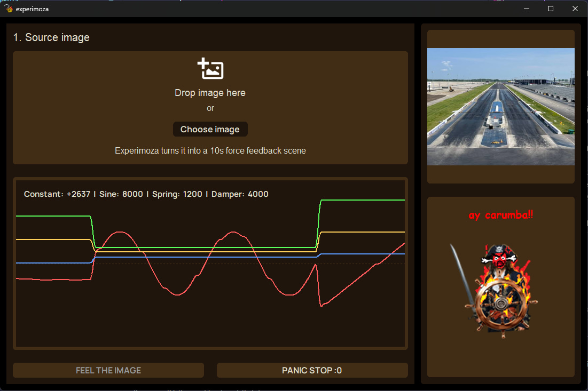

# Experimoza 

<p align="center">
  
</p>

<h3 align="center">AI-Powered Force Feedback Generated from Any Image</h3>

<p align="center">
  <strong>Built for Stardance</strong>
</p>

## Overview

experimoza turns a photo into a 10-second AI-generated force-feedback scene for a racing wheel. it uses gemini to translate the image’s mood and texture into physical wheel motion, so you can literally feel a picture through the steering wheel.

## Motivation

basically, this is a quite spontaneous project. i've found out about hack club and i was **SOOOO** motivated to code something. i've looked around everywhere in my room until i've looked on my moza r3 wheel and thought of this.

## Features

- **Image to FFB** - Turns an image into a 10-second force feedback scene
- **Gemini Integration** - Generates the force feedback code
- **Four FFB Effects** - Constant force, sine vibration, spring, and damper
- **Live Visualisation** - Displays the active forces and wheel position using a funny pirate that gets furious, if spins too quickly.

## Screenshots



## Prerequisites

- Windows 10 or 11
- Python 3.10+
- A DirectInput-compatible force feedback wheel (tested with MOZA R3)
- A Gemini API key

## Python Dependencies

```bash
pip install google-genai python-dotenv customtkinter pillow tkinterdnd2 matplotlib comtypes
```
## Usage

#### Download source code -> Add your API key to .env -> Open ui.py -> Drop the image -> **FEEL THE IMAGE**

## Credits

**[py_directinput_ffb](https://github.com/sunwj/py_directinput_ffb/tree/main)** by [sunwj](https://github.com/sunwj) - DirectInput force feedback binding used for wheel control. Modified for Experimoza.

## License

MIT License - See [LICENSE](LICENSE) for details.